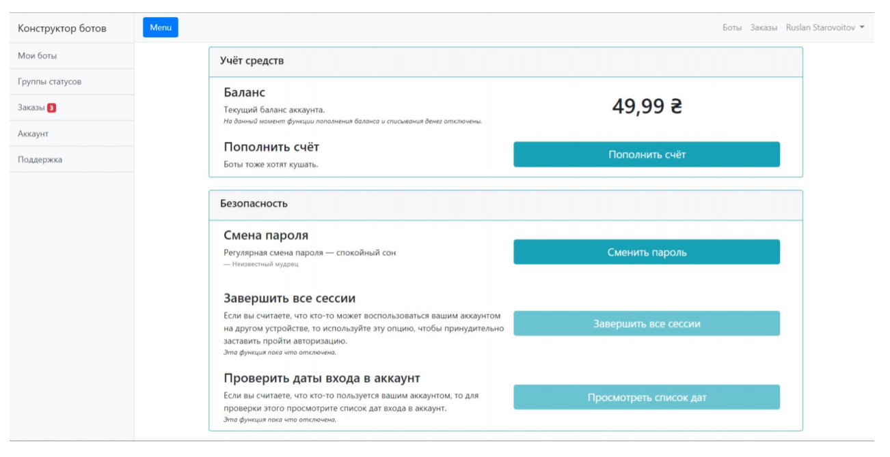

# [BotsConstructor](https://botsconstructor.com/)

### Constructor of Telegram bots for orders

Designed to quickly and easily create bots for Telegram.
Allows anyone without programming skills to build their own bot from the provided different types of nodes.
Initially, this constructor was conceived as a solution for small businesses, so you can place orders in the collected bots, and the site has a page for processing them.
The constructor itself consists of a site where you can collect bots and work with orders,
and "forests" - a server of bots, on which bots are launched according to the created tree structure.

#### Tree editor
The site has the ability to create a bot markup - a special tree structure of nodes of different types.
Nodes have different parameters depending on the type, but they can all have a name, text and an attached file.
In a running bot, the name of the node is displayed on the button, which, when clicked, will go to the node.
When you go to the site, the text and the attached file (if any) are sent.

#### Types of nodes
* ** Root ** - This is a regular InfoNode, but it cannot be deleted, moved or added.
* ** Info node ** - the simplest node containing information (text and file).
* ** Section ** is a special node that makes it easy to display a large number of descendant nodes.
It can display them as a list of titles, or send by 2.
* ** Product ** - a node that has parameters for working with different products (including products with different subtypes, subtypes and prices).
The bot user can add products to the cart.
Product node also has 2 subtypes that affect the display style.
* ** Data Entry ** - node that allows you to add data from the user to the order. You can enter text, time and attach different types of files.
* ** Send order ** - node, upon switching to which the bot user sends the generated order.
Within this node, you can select one of the status groups for quick responses to orders sent through this node.

  #### Orders
All user generated orders are added to the bot owner's orders page.
Bot owners have the ability to respond to orders, change their status and delete them.

#### Status groups
Status groups are designed for convenient separation of order states and quick responses to orders using short messages.

#### Additional functions
* ** Bulk mailing ** - sending one message to all users of the bot (you can attach a file).
* ** Change token ** - transfer of markup to another Telegram bot.
* ** Moderation ** - the ability to invite bot moderators who cannot edit it, but are able to interact with orders.

 Собранный бот, содержащий в себе дополнительную информацию: [@bctor_info_bot](https://telegram.me/bctor_info_bot).

